# #130 — the accessibility sweep from the audit

Fourteen findings from the 2026-09-01 audit, done in one pass. The rule
throughout: **nothing at rest moves**. What changes is what a keyboard sees
and what a screen reader hears — focus rings that were the browser's are now
the theme's, semantics that were implied are now written down, and the two
things a pointer alone could reach (the way in's arrows, the hover-lit
ornaments) now answer a keyboard and a touch as well.

## The intentional visual changes

Only three, and every one of them is a **focus** state — no resting pixel on
any of the ten scene and long-form stops moves by more than 0.02 % on
desktop or 0.48 % on mobile (that last is the known who-we-are /
house-churches animation patch, unchanged by this issue).

### 1. Every link, button and switch wears the theme's focus ring

`FOCUS_RING` (`src/theme/classes.ts`) — a hairline `ring-cream/60` stood off
the element by two pixels of ink — was already on the nav's words and the
way in's arrows. It now reaches the places that were still falling back to
Chrome's default outline, or to nothing: the mobile sheet's links and pills,
both G-mark links, the section rail's dots, and the ornaments' new switches.

| | |
|---|---|
| a nav link, focused (desktop 1600×900 @2×) | 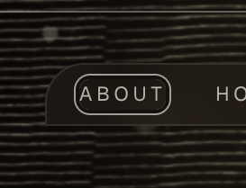 |
| the G mark, now a link named Home | 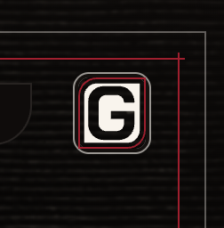 |
| a sheet link, focused (mobile 390×844 @3×) | 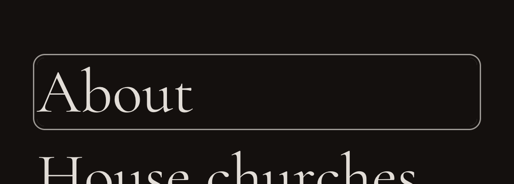 |

The one place this replaces something rather than adding it is the sheet's
Close button, which radix focuses as the sheet opens. It wore Chrome's
default `outline: auto`; it now wears the theme's ring. This is the whole of
the `menu.png` shot-gate delta (0.32 %):

| before (Chrome's outline) | after (the theme's ring) |
|---|---|
| 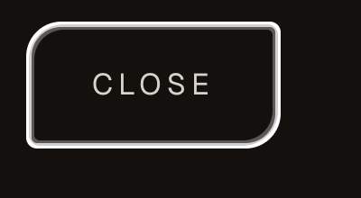 | 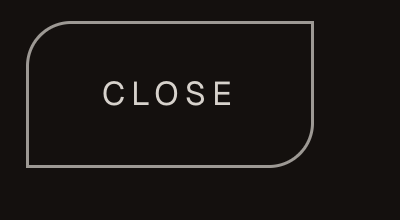 |

### 2. The section rail's written label is now the accessible name

Each dot carried an `aria-label` *and* a written-out label that only appeared
on hover or focus, and the written one was `aria-hidden`. Two names for one
link, free to drift. The `aria-label` is gone; the written words are the
name, and they reveal on `:focus-visible` as they always did on hover — so
what a screen reader reads and what the eye sees are now the same string.

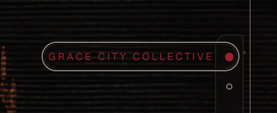

### 3. The hover-lit ornaments have a switch

The house table, the shared life, the sown field and each gathering's emblem
lit only under a pointer. Each drawing is now wrapped in an
`OrnamentSwitch` — a toggle button that takes the classes the drawing wore,
so the box is unchanged, named from the content and reporting `aria-pressed`.
Enter or Space (or a tap) lights the drawing and holds it lit; the ring is
the only new ink at rest.

| | |
|---|---|
| the switch, focused (desktop) | 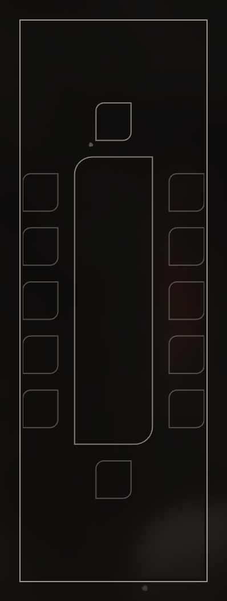 |
| pressed — the table seated | 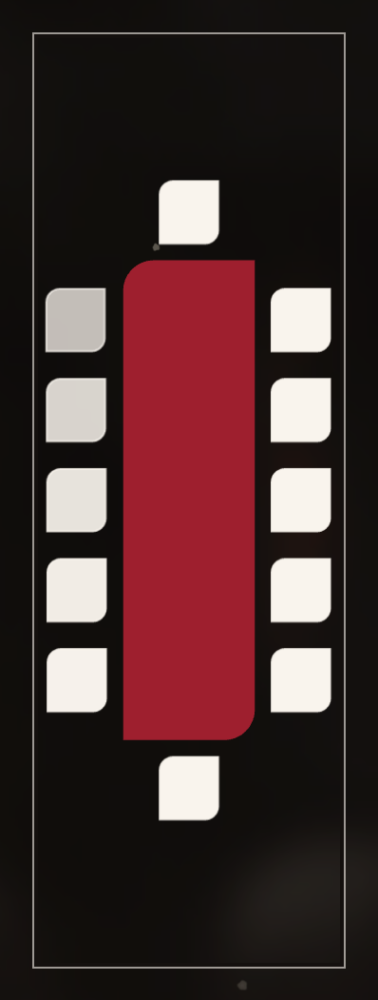 |
| the same on a phone, where the switch is a touch's only way in |  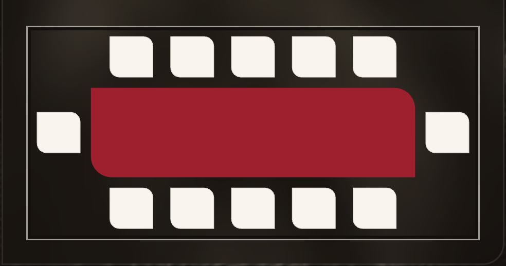 |

### And the way in's arrows

No pixel changes here, but the behaviour does: an arrow that reaches its end
disables, and a disabled button drops the keyboard's focus on the floor. The
walk now hands focus to the *other* arrow first, inside the same press, so
the reader turns round where they are and never lands on `<body>`.

| the Next arrow, focused | after the last step, focus on Back |
|---|---|
| 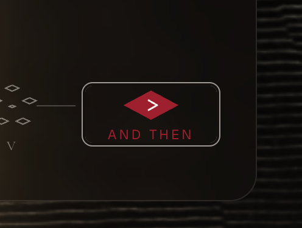 | 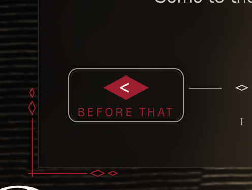 |

## The browser walk

`desktop-walk.txt` and `mobile-walk.txt` are the transcripts: Tab, Enter,
Escape and Space only, driven over CDP against the built site in
hardware-accelerated headless Chrome, at 1600×900 @2× and 390×844 @3×
(mobile emulation, touch on). Each stop records what has focus, its
accessible name, whether it matches `:focus-visible`, and what the browser
actually paints for the focus. Both walks end with an `axe-core` pass over
the live page.

The headline results, identical on both widths unless noted:

- while the splash is up the page under it is `inert` and **no** tabbable
  remains outside it — a Tab lands nowhere; the status line reads
  *"Press any key to skip the intro."*; Enter skips it and the page comes back;
- every stop on the walk matches `:focus-visible` and paints the theme's ring
  — not one falls back to no indicator;
- the sheet is named *Menu* and described in the content's words; Escape
  closes it and returns focus to the Menu button that opened it;
- the way in walks to its end and back, focus crossing to the other arrow as
  one disables, and `#visit`'s live region is **the same DOM node**
  throughout (`aria-atomic="true"`), so the step is announced in place;
- a Space on an ornament's switch lights the drawing and a second Space puts
  it out. (On the phone the drawing is already lit by the beat it plays as
  the panel settles, so the walk can only show `aria-pressed` toggling there;
  the jsdom test asserts the below-lg press lights it from dark.)

`axe` reports **no violations at all** on desktop, and on mobile only
`color-contrast`, four nodes — see below.

## The two audits that stay

- **`color-contrast`, mobile, four nodes.** The kicker labels (`kicker` in
  `src/theme/classes.ts`: 11 px uppercase `text-seal` #9e1f2e on ink
  #14100e) measure 2.42:1 against the 4.5:1 WCAG AA asks for text that size.
  This is exactly the audit already recorded in
  `docs/perf/lighthouse-baseline.md`, and it is **a brand decision, not a
  bug**: the seal red on ink is the mark's own pair. Nothing here changes a
  colour. It needs a call on the palette, not a sweep.
- **`meta-description`** is SEO, not accessibility, and belongs to #108.

Nothing else is outstanding: with those two set aside, axe is clean in the
browser on both tiers and in jsdom in every state the keyboard can reach —
the sheet open, the way in stepped to its end, an ornament lit
(`App.a11y.test.tsx`; `color-contrast` stays disabled under jsdom, which has
no layout to measure it with).
